# Jibril
- [Project Description](#project-description)
- [Official Game Rules](#official-game-rules)
- [General Rules](#general-rules)
- [Features](#features)
  - [Single Player Mode](#single-player-mode)
  - [Versus Mode](#versus-mode)
- [About Us](#about-us)
- [Gameplay](#gameplay)
  - [Single Player](#single-player)
  - [Versus Mode](#versus-mode-1)
- [Concepts and Ideas](#concepts-and-ideas)
- [Project Information](#project-information)
- [Theme](#theme)

## Project Description

  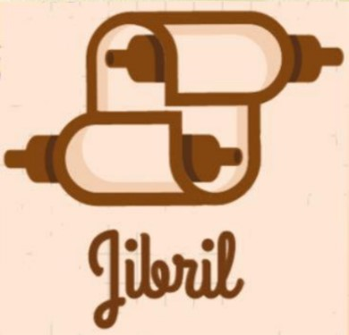

  Jibril is a single/multi-player word game where players test their vocabulary against time or other players. It is based on a Japanese word game called "Shiritori," where players take turns saying a word that begins with the last character of the previous word. In this game, players type a word that begins with the last letter of the previous word, either against the clock (Single player) or against other players (Versus mode).

  

## Official Game Rules

- Take the last letter of the reference/previous word and think of a word that starts with the same letter.
- Play a word before the time expires.
- Words that have already been used cannot be played again.
- Wrong spelling words are unacceptable.
- Using a word that does not start with the last letter of the reference/previous word is invalid.
- Only words from the English language are acceptable.
- Score is based on the number of letters in each word that is correctly played.

## General Rules

- There is a 10-second time limit each turn.
- Not complying with the general rules results in game over.
- Players can customize the game duration and the time limit per turn.
- Not complying with the general rules will result in a player losing a turn.
- Players can choose to continue or surrender in between turns.
- The game will end if one player surrenders or the game duration expires.
- The player with the highest score wins.

## Features

**Jibril** has two main features:

### Single Player Mode

In this mode, players race against themselves to score as many words as they can within the given time limit. Longer words yield higher scores.

### Versus Mode

Players can compete against each other in a two-player game. They can customize game rules such as game duration and time limit per turn. The player who complies with the rules and achieves the highest score wins.

## About Us

We are a group of computer engineering students from Polytechnic University of the Philippines who are aspiring to be professional engineers. **Jibril** is the result of our passion and interest in game development. We aim to provide a fun, enjoyable, and entertaining game while also promoting learning through vocabulary challenges.

## Gameplay

The main gameplay involves taking the last letter of the initial word and creating another word from it. Players must adhere to five rules:

1. Answer within the time limit.
2. Avoid repeating used words.
3. Spell words correctly.
4. Use a word that starts with the last letter of the initial word.
5. Use only English words.

There are two game modes:

### Single Player

Players race against the time limit, entering words complying with the rules. The time limit decreases with each round.

  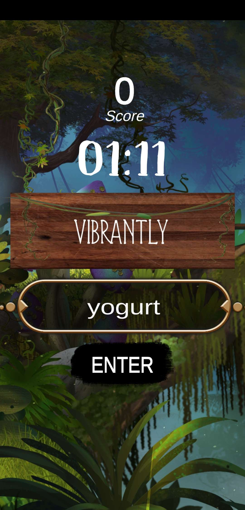
  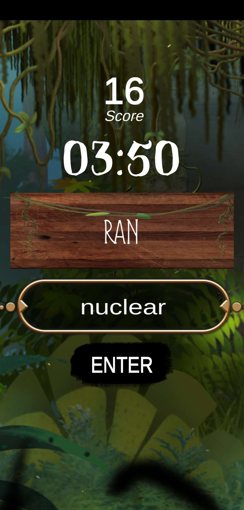 
  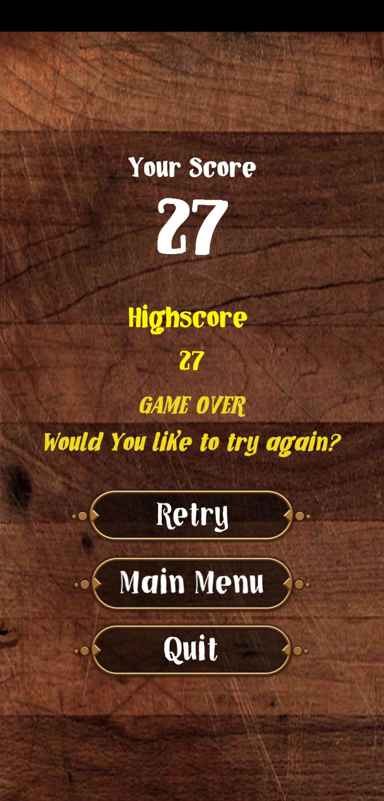

### Versus Mode

Players interact and play with each other, customizing game settings. The game automatically randomizes the order of player turns. Failure to comply with the rules results in a loss for that player.

  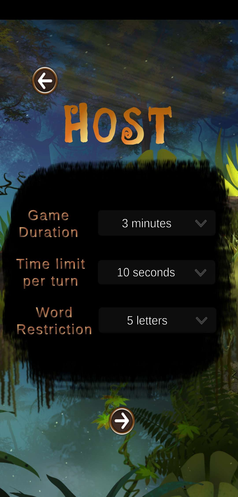
  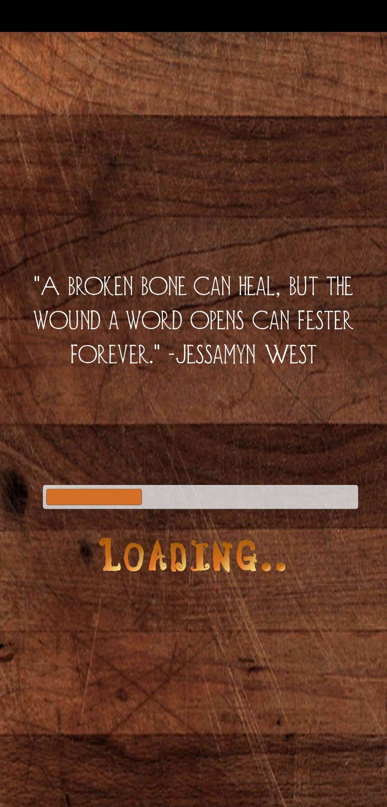
  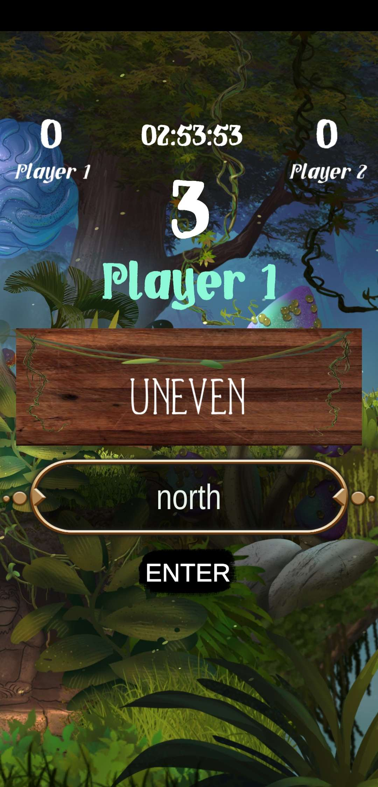
  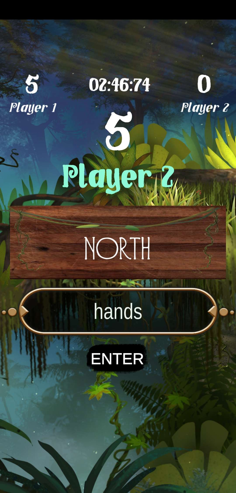

  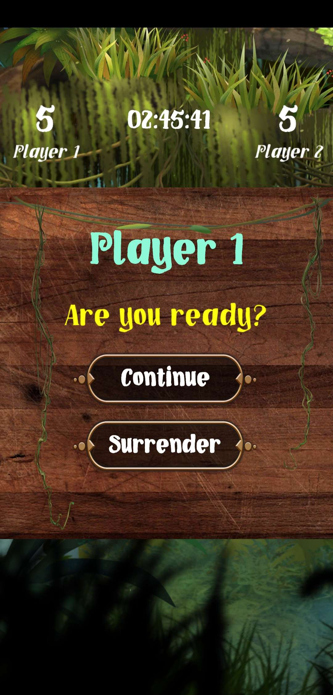
  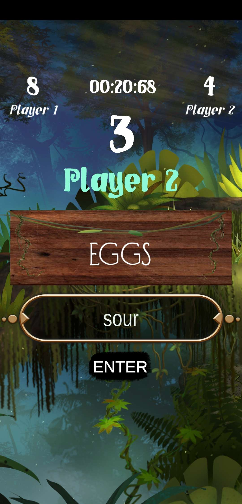
  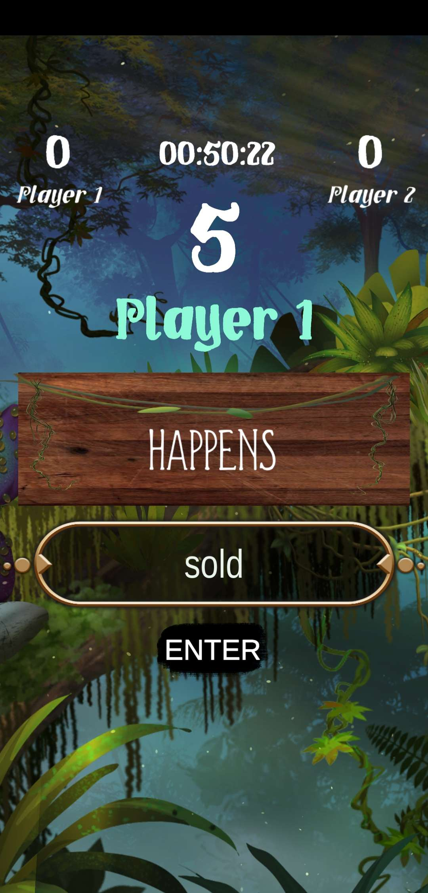
  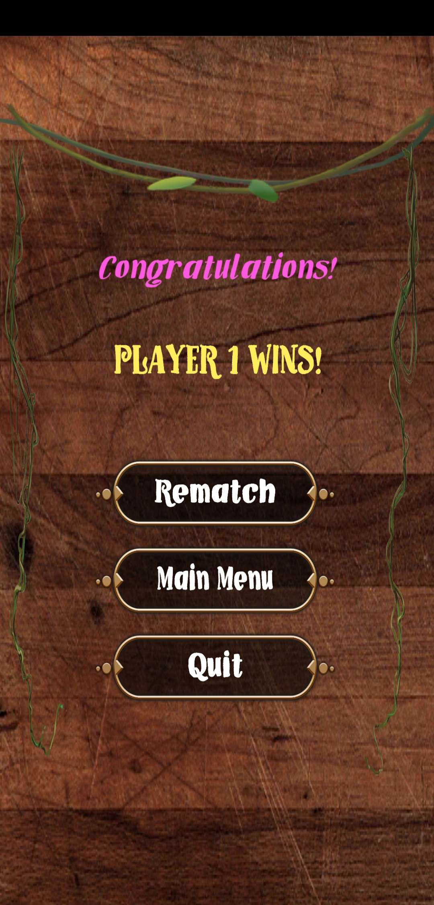

## Concepts and Ideas

Some considerations for future development include:

1. Increasing the maximum number of players in multiplayer mode.
2. Adding a "Pass" command for players to skip a turn.
3. Allowing players to make a limited number of mistakes.

## Project Information

- **Name**: Jibril
- **Copyright**: (C) 2021 All Rights Reserved
- **Developers**: Computer engineering students from Polytechnic University of the Philippines
- **Platform**: Mobile devices

## Theme

The game's theme revolves around magic and wizards, inspired by the concept of chanting magic words to trigger spells. The background theme includes jungle ruins to create a light and stress-relieving atmosphere for players.

---

*Jibril is not just a game; it's a journey into the world of words and strategy. Join us and challenge your vocabulary prowess today!*
